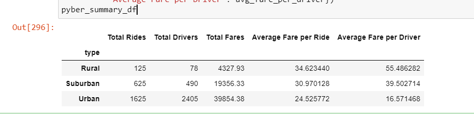
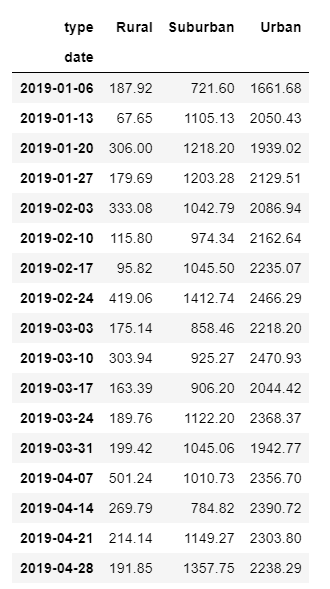
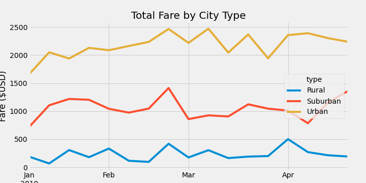

# PyBer_Analysis

# Overview of the analysis: 
>The purpose of this analysis is to show data visualizations for a Pyber CEO. The types of visualizations include pie charts, box-and-whisker plots, bubble charts and line charts. I compared 3 types of cities: rural, urban and suburban cities by fares, driver count and ride counts.

# Results:

For this challenge, there were 2 deliverables: 

1. I had to create a final dataframe that showed an analysis of the 3 city types showing total rides, total drivers, total fares, average fare per ride, average fare per driver.

In order to calculate this, I calculated the count of rides by city types. Then the sum of drivers by city type. Next, the sum of fares by city type. After finding the calculations with that information, I then calculated the average fare per ride by city and average driver per city. Results of a combined dataframe is shown in output 296 in "PyBer_Challenge.ipynb". 

2. Next, I had to create a new DataFrame that would look at fares by city type between the dates of January 1st, 2019 til April 29th, 2019. I created a DataFrame that showed the analysis per week between the two dates (17 weeks).

**Below is the data shown in a multiple line graph that compares fares by city types:**

# Summary:

Based on my analysis and creating a multiple line chart to display the results, ride-sharing seems to be more profitable in urban cities. The second type of city that is profitable is suburban cities and rural cities ranking the least profitable.

Three recommendations I could provide in order to address these disparities among the city types is:

1. It seems that fares in rural areas are high which may deter riders from wanting to order a ride through Pyber. Lowering fares could encourage riders to order more rides in rural areas.
2. It could be possible that fares are higher in rural areas is because there is a limited resource of drivers in rural areas. Offering incentives for drivers in rural areas could help in gaining more driver resources in rural areas.
3. Ride counts in rural areas are also possibly due to a lower population. It could be interesting to see how we could bring the 3 city type closer by offering a "destination ride/weekend getaway" incentive during shelter in place where Pyber can offer a discounted ride to a nearby big urban city area versus flying in a plane. This also might incentivize riders to want to use Pyber.
